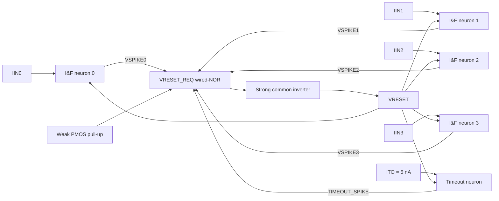

# Architecture

**Design:** GPDK45 time-domain winner-take-all network

**Revision:** 1.0 - 2026-09-17

**Related:** [Calculations](01-calculations.md) | [Decisions](03-design-decisions.md) | [Final design](04-final-design.md)

## 1. System purpose

The network converts analog input currents into spike latency. All neurons begin a competition together. The largest current charges its soma capacitor fastest, reaches the threshold first, emits a spike, and starts a shared reset that suppresses the other neurons.

The baseline contains four signal neurons and one timeout neuron. The timeout neuron receives a fixed 5 nA current and represents “no signal input exceeded the minimum decision threshold.”

## 2. Top-level architecture



## 3. Neuron architecture

```text
                         CFB = 20 fF
                 +---------||----------+
                 |                     |
IIN  ---------- VSOMA --> INV A1 --> INV A2 --> VSPIKE
                 |                               |
             CSOMA = 200 fF                     gate
                 |                               |
                VSS                       M_REQ NMOS
                                                 |
VRESET_REQ --------------------------------------+---- weak pull-up to VDD

VSOMA -- M_RST (gate=VRESET) -- M_LEN (gate=VSPIKELEN) -- VSS
```

Each neuron has four functional blocks:

1. **Integrator:** `IIN`, `CSOMA`, `CFB`, and parasitics form the membrane/soma state.
2. **Neuromorphic amplifier:** two inverters convert the analog threshold crossing into an all-or-none spike.
3. **Request transistor:** `M_REQ` pulls the shared active-low request node down when that neuron spikes.
4. **Reset discharge:** `M_RST` enables the path; `M_LEN` limits its current and controls spike/reset behavior.

## 4. Shared reset architecture

`VRESET_REQ` is normally high because of a weak 250 nA PMOS pull-up. Every `M_REQ` drain connects to this node, producing a wired-NOR: one or more spikes pull it low. A strong common inverter converts that low level to active-high `VRESET`.

When the winning spike falls, the weak pull-up slowly charges `VRESET_REQ`. The intentional 80 fF total node capacitance extends reset long enough for every soma node to fall below 50 mV. This prevents a losing neuron from retaining a head start into the next competition.

## 5. Event sequence

```mermaid
sequenceDiagram
    participant Inputs
    participant Winner as Winning neuron
    participant Request as VRESET_REQ
    participant Reset as VRESET
    participant Array as All soma nodes

    Inputs->>Array: Apply concurrent input currents
    Array->>Array: Soma voltages ramp at I/CTOT
    Winner->>Winner: VSOMA crosses VTRIP
    Winner->>Request: VSPIKE turns M_REQ on
    Request->>Reset: Falling request asserts reset
    Reset->>Array: All soma nodes discharge
    Winner->>Request: VSPIKE falls; M_REQ releases
    Request->>Request: Weak pull-up charges node slowly
    Request->>Reset: Reset deasserts after about 167 ns
    Reset->>Array: Next competition begins
```

## 6. Interfaces and polarity

| Signal | Type | Inactive | Active | Purpose |
|---|---|---:|---:|---|
| `VDD` | power | - | 1.0 V | Core supply |
| `VSS` | power | - | 0 V | Ground |
| `IIN[3:0]` | analog input | 0 A | 1-100 nA | Signal currents |
| `ITO` | analog bias | - | 5 nA | Timeout threshold |
| `VSOMA<i>` | internal analog | near 0 V | rising ramp | Integrated state |
| `VSPIKE[3:0]` | digital output | 0 V | 1 V pulse | Signal winner |
| `TIMEOUT_SPIKE` | digital output | 0 V | 1 V pulse | No signal exceeded threshold |
| `VRESET_REQ` | shared analog/digital | 1 V | pulled to 0 V | Active-low request |
| `VRESET` | shared digital | 0 V | 1 V | Active-high soma discharge |
| `VSPIKELEN` | analog bias | - | about 0.446 V | Reset-current control |
| `VBP_RESETLEN` | analog bias | - | about 0.56 V | Weak pull-up control |

## 7. Hierarchy

```text
tdwta4_top
|-- tdwta_neuron signal_0
|-- tdwta_neuron signal_1
|-- tdwta_neuron signal_2
|-- tdwta_neuron signal_3
|-- tdwta_neuron timeout
|-- tdwta_reset_shared
|-- bias inputs / bias generator
`-- optional identical output buffers
```

The five neuron instances must be identical. The timeout function is created by its input current, not by changing its circuit.

## 8. Startup

At startup the soma capacitors must be discharged. During schematic verification, force `VRESET` high for 500 ns or apply initial conditions of 0 V. For a standalone silicon block, add an explicit `RESET_INIT` path and include it in extracted verification. Do not rely on simulator capacitor defaults for the final design.

## 9. Scaling

- Up to approximately 16 neurons, verify whether the single common reset inverter still meets the 2 ns total spike-to-reset-delay target.
- Beyond that point, use a tapered reset buffer and a balanced reset tree.
- Every array-size change alters request-node capacitance, reset fanout, delay, timing discrimination, and power.
- Strict arbitration of mathematically equal inputs is not inherent to this architecture. An exact tie can produce simultaneous spikes; add an arbiter only if the system requires strict one-hot behavior for ties.

## Revision notes

- **1.0 - 2026-09-17:** Four signal neurons, one matched timeout neuron, wired-NOR request, shared reset, and two-inverter threshold amplifier.
