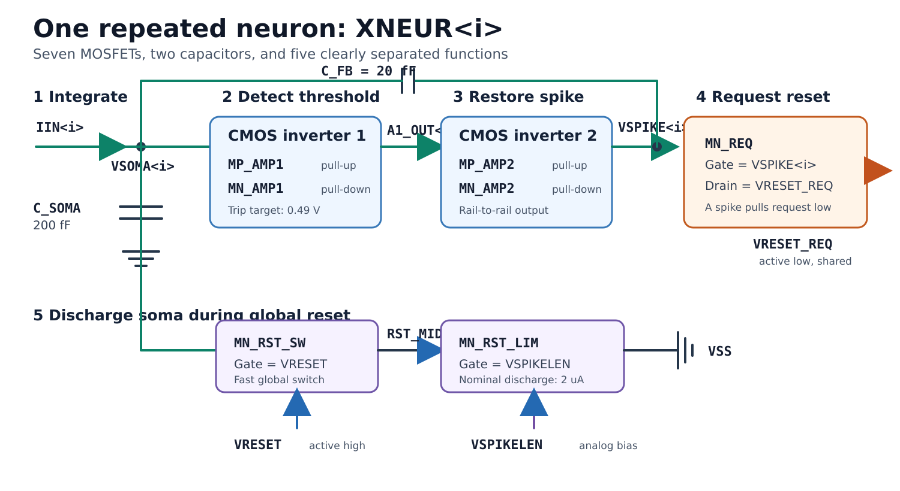
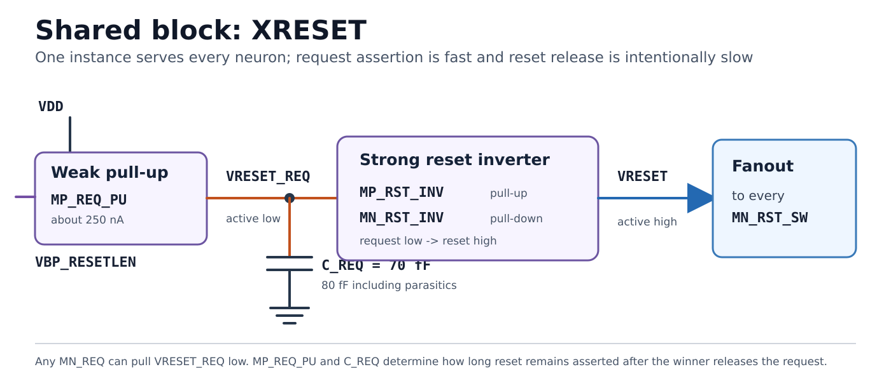
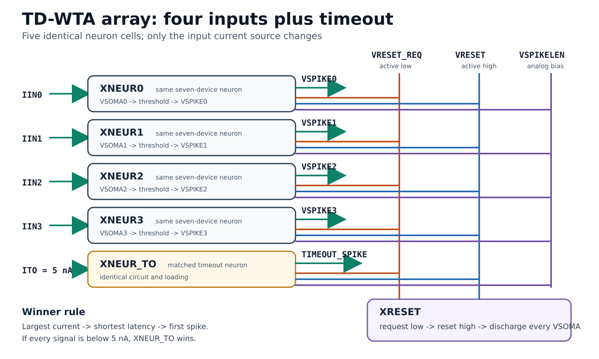

# Circuit Walkthrough and Naming Convention

**Design:** GPDK45 time-domain winner-take-all network  
**Revision:** 1.1 - 2026-09-17  
**Source:** J. P. Abrahamsen, P. Hafliger, and T. S. Lande, “A Time Domain Winner-Take-All Network of Integrate-and-Fire Neurons,” ISCAS 2004.  
**Related:** [Calculations](01-calculations.md) | [Architecture](02-architecture.md) | [Decisions](03-design-decisions.md) | [Final design](04-final-design.md)

## 1. What the circuit computes

Every neuron converts its input current into a delay. Starting from a discharged soma node, a larger current charges the same effective capacitance faster:

```text
VSOMA(t) = IIN*t/CTOT
Tfire = VTRIP*CTOT/IIN
```

All neurons start together. The neuron with the largest current reaches `VTRIP` first, raises its `VSPIKE`, pulls the common active-low request node down, and causes the shared block to raise `VRESET`. That reset discharges every soma node, so later neurons cannot spike in the same competition. Winner identity is carried by the active output; winner magnitude remains encoded in the repetition rate.

The implementation in this repository is a **topology-preserving retarget**, not a transistor-size copy of the paper. The paper reports a 0.6 um AMS implementation, `C` about 1.56 pF, `Vtheta` about 1.9 V, and a reset-onset estimate near 1 ns. This repository targets 1.0 V GPDK45 devices, 235 fF effective soma capacitance, a nominal 0.49 V trip point, and a deliberately extended reset pulse.

## 2. Neuron circuit diagram



The paper draws the threshold amplifier as one triangle even though the text defines it as two inverters. The diagram above expands that triangle into four named MOSFETs and keeps the signal path, feedback path, request device, and soma-discharge path visually separate.

## 3. Naming convention

Use functional names inside each hierarchical cell. In Cadence, the full reference is the hierarchy plus the local name, for example `XNEUR2/MN_REQ`. If a flattened netlist is needed, use the neuron suffix, for example `MN_REQ2`. Do not return to opaque references such as `MN1`, `MN2`, or `M3`.

| Prefix/suffix | Meaning | Example |
|---|---|---|
| `XNEUR<i>` | Signal-neuron instance | `XNEUR2` |
| `XNEUR_TO` | Identical timeout-neuron instance | `XNEUR_TO` |
| `XRESET` | Single shared reset block | `XRESET` |
| `MN_` / `MP_` | NMOS / PMOS | `MN_REQ`, `MP_REQ_PU` |
| `AMP1`, `AMP2` | First threshold-sensing inverter, second restoring inverter | `MP_AMP1` |
| `REQ` | Pull-down device on active-low request | `MN_REQ` |
| `RST_SW` | Reset-controlled soma switch | `MN_RST_SW` |
| `RST_LIM` | Bias-controlled soma discharge limiter | `MN_RST_LIM` |
| `REQ_PU` | Weak request-node pull-up | `MP_REQ_PU` |
| `RST_INV` | Strong shared reset inverter | `MP_RST_INV` |
| `C_` | Capacitor | `C_SOMA`, `C_FB`, `C_REQ` |

### 3.1 Complete device dictionary

Connections are written as `(D, G, S, B)`. Dimensions are `W/L` in um and remain nominal until the installed GPDK45 models are swept.

| Hierarchical reference | Connections | Nominal size/value | Role |
|---|---|---:|---|
| `XNEUR<i>/MP_AMP1` | `(A1_OUT<i>, VSOMA<i>, VDD, VDD)` | 0.90/0.09 | First-inverter pull-up |
| `XNEUR<i>/MN_AMP1` | `(A1_OUT<i>, VSOMA<i>, VSS, VSS)` | 0.36/0.09 | First-inverter pull-down |
| `XNEUR<i>/MP_AMP2` | `(VSPIKE<i>, A1_OUT<i>, VDD, VDD)` | 1.80/0.06 | Output-restoring pull-up |
| `XNEUR<i>/MN_AMP2` | `(VSPIKE<i>, A1_OUT<i>, VSS, VSS)` | 0.72/0.06 | Output-restoring pull-down |
| `XNEUR<i>/MN_REQ` | `(VRESET_REQ, VSPIKE<i>, VSS, VSS)` | 0.72/0.06 | Asserts shared request low |
| `XNEUR<i>/MN_RST_SW` | `(VSOMA<i>, VRESET, RST_MID<i>, VSS)` | 0.60/0.06 | Enables global soma reset |
| `XNEUR<i>/MN_RST_LIM` | `(RST_MID<i>, VSPIKELEN, VSS, VSS)` | 0.18/0.18 | Limits discharge to about 2 uA |
| `XNEUR<i>/C_SOMA` | `(VSOMA<i>, VSS)` | 200 fF | Main integrating capacitor |
| `XNEUR<i>/C_FB` | `(VSPIKE<i>, VSOMA<i>)` | 20 fF | Regenerative charge feedback |
| `XRESET/MP_REQ_PU` | `(VRESET_REQ, VBP_RESETLEN, VDD, VDD)` | 0.18/0.36 | About 250 nA weak pull-up |
| `XRESET/MP_RST_INV` | `(VRESET, VRESET_REQ, VDD, VDD)` | 3.60/0.06 | Shared reset-inverter pull-up |
| `XRESET/MN_RST_INV` | `(VRESET, VRESET_REQ, VSS, VSS)` | 1.44/0.06 | Shared reset-inverter pull-down |
| `XRESET/C_REQ` | `(VRESET_REQ, VSS)` | 70 fF | Explicit reset hold capacitor; 80 fF total target |

For `XNEUR_TO`, replace `<i>` with `_TO`; its devices and capacitors must remain identical to the signal neurons.

## 4. Stage-by-stage operation

### Stage 1 - Current integration

`IIN<i>` injects current into `VSOMA<i>`. With `VRESET = 0`, `MN_RST_SW` is off, so `C_SOMA`, `C_FB`, and local parasitics integrate the current. The repository budgets:

```text
CTOT = C_SOMA + C_FB + CPAR,SOMA
     = 200 fF + 20 fF + 15 fF
     = 235 fF
```

No input MOSFET is hidden at the `IIN` arrow in the paper; the input is a current delivered by the sensor or a test current source.

### Stage 2 - Threshold detection and regenerative feedback

`MP_AMP1/MN_AMP1` form the analog threshold inverter. As `VSOMA` rises through its switching point, `A1_OUT` falls. `MP_AMP2/MN_AMP2` invert that signal again, so `VSPIKE` rises. The two inversions make `VSPIKE` have the same logical direction as the soma threshold crossing.

The rising `VSPIKE` couples charge through `C_FB` and raises `VSOMA` by about:

```text
Delta VSOMA = C_FB/CTOT * Delta VSPIKE
            = 20 fF/235 fF * 1 V
            = 85 mV nominal
```

This positive kick makes the transition decisive and reduces chatter around the inverter trip point. When `VSPIKE` later falls, the same capacitor removes charge and helps return the neuron below threshold.

### Stage 3 - Winner request

`VSPIKE` drives `MN_REQ`. A high spike turns `MN_REQ` on and rapidly discharges `VRESET_REQ`. Because the drains of every `MN_REQ` share one node, any spike can assert the request. The node is active low; this is the paper's wired-NOR function.

The first spike is the winner request. A second neuron can also spike only if its threshold crossing occurs within the request-to-effective-reset propagation delay. This is why the shared request node must remain compact and the reset driver must be strong.

### Stage 4 - Shared reset generation



`MP_RST_INV/MN_RST_INV` sense `VRESET_REQ`. When the request goes low, the inverter drives `VRESET` high. `VRESET` fans out to the gate of every `MN_RST_SW`, simultaneously enabling all soma discharge stacks.

The inverter is intentionally asymmetric in function, not polarity: assertion must be fast enough to preserve discrimination, while deassertion is delayed by the weak pull-up and `C_REQ`.

### Stage 5 - Controlled soma discharge

For each neuron, `MN_RST_SW` is the digital switch and `MN_RST_LIM` is the analog current limiter. `VSPIKELEN` biases `MN_RST_LIM` near a nominal 2 uA. Keeping these functions in separate devices prevents the reset-current estimate from depending mainly on the on-resistance of a single switch.

The soma is discharged while `VRESET` is high. The target is for every `VSOMA` to reach less than 50 mV before reset releases. This avoids the paper's “head-start” failure, where a losing neuron retains charge and can incorrectly win a later cycle.

### Stage 6 - Delayed reset release

When the winning `VSPIKE` falls, its `MN_REQ` turns off. `MP_REQ_PU` then charges `VRESET_REQ` slowly. With 80 fF total request-node capacitance and about 250 nA pull-up current, the request node needs roughly 157 ns to return to the reset inverter's nominal 0.49 V threshold. Including the approximately 10 ns spike interval, the nominal shared reset pulse is about 167 ns.

The paper labels the pull-up current `IresetLen`. In this retarget:

- `IresetLen` is the function/current, about 250 nA.
- `MP_REQ_PU` is the transistor that realizes it.
- `VBP_RESETLEN` is the PMOS gate bias, initially estimated at 0.56 V.
- `C_REQ` is an explicit retargeting addition that makes the pulse width less dependent on accidental wiring capacitance.

## 5. Full array interconnect



The baseline has four signal neurons and one timeout neuron. The timeout neuron receives a fixed 5 nA current. It is not a different cell: it has the same circuit, loading, orientation, and nominal layout as every signal neuron.

- If any `IIN<i> > 5 nA`, the largest signal current should spike before the timeout neuron.
- If every `IIN<i> < 5 nA`, `XNEUR_TO` should emit `TIMEOUT_SPIKE` first.
- At exactly 5 nA, mismatch and noise determine the result; the architecture does not guarantee a preferred winner.
- Exact ties do not guarantee one-hot output. A separate arbiter is required if the system specification demands deterministic tie resolution.

## 6. One complete competition

| Step | `VSOMA` | `VSPIKE` | `VRESET_REQ` | `VRESET` | Meaning |
|---:|---|---|---|---|---|
| 0 | Near 0 V | Low | High | Low | Array is ready |
| 1 | All ramp at `IIN/CTOT` | Low | High | Low | Currents become latencies |
| 2 | Winner crosses `VTRIP` | Winner rises | Starts falling | Low | Winner is selected |
| 3 | Winner held above threshold by `C_FB` | High | Low | Rises quickly | Reset is asserted |
| 4 | Every soma discharges | Winner eventually falls | Held low, then slow rise | High | Losers are prevented from firing |
| 5 | Every soma below 50 mV | Low | Crosses inverter threshold | Falls | Next competition begins |

## 7. Paper results and limits that matter to this implementation

The source paper derives the ideal firing latency `T = Vtheta*C/I` and timing-limited discrimination:

```text
(1/Irunner-up - 1/Iwinner) > td/(Vtheta*C)

x > k/(1+k)
k = Iwinner*td/(Vtheta*C)
x = 1 - Irunner-up/Iwinner
```

This says that discrimination degrades as winner current or reset-onset delay grows. In silicon, capacitor mismatch, sensor-current mismatch, inverter threshold mismatch, noise, and reset-tree skew can dominate the ideal equation. The paper also demonstrates the head-start failure caused by too-short reset pulses. Those two constraints pull in different directions: reset must assert quickly, but remain asserted long enough to erase all soma charge.

The paper's optional extensions are not part of Revision 1.1:

1. A threshold mode lets every neuron above a threshold win by changing local/global reset connectivity.
2. An n-strongest mode replaces the timeout's constant source with a spike-controlled accumulator.

Neither extension should be added to the baseline schematic without a separate specification and verification plan.

## 8. Verification order

1. DC-sweep `VSOMA` and measure the `MP_AMP1/MN_AMP1` trip point.
2. Verify `VSPIKE` is rail-to-rail and the feedback step is 70-100 mV without chatter.
3. With ideal reset controls, calibrate `VSPIKELEN` for the intended discharge current.
4. With an ideal 250 nA request pull-up, measure request-to-reset delay and reset width.
5. Restore `MP_REQ_PU`, sweep `VBP_RESETLEN`, and repeat over PVT.
6. Test clear winner, timeout, near tie, exact tie, and dynamic handover cases.
7. Run mismatch Monte Carlo, then repeat every timing test on the extracted view.

The transistor dimensions and bias voltages in the diagram are construction starting points. They are not sign-off values until the local PDK models meet the pass criteria in [Final design](04-final-design.md).

## Revision notes

- **Diagram refresh - 2026-09-17:** Split the dense circuit drawing into three simpler diagrams for the neuron, shared reset block, and full array.
- **1.1 - 2026-09-17:** Added explicit transistor naming, expanded schematics, paper-to-retarget mapping, stage explanations, and full-array signal flow.
